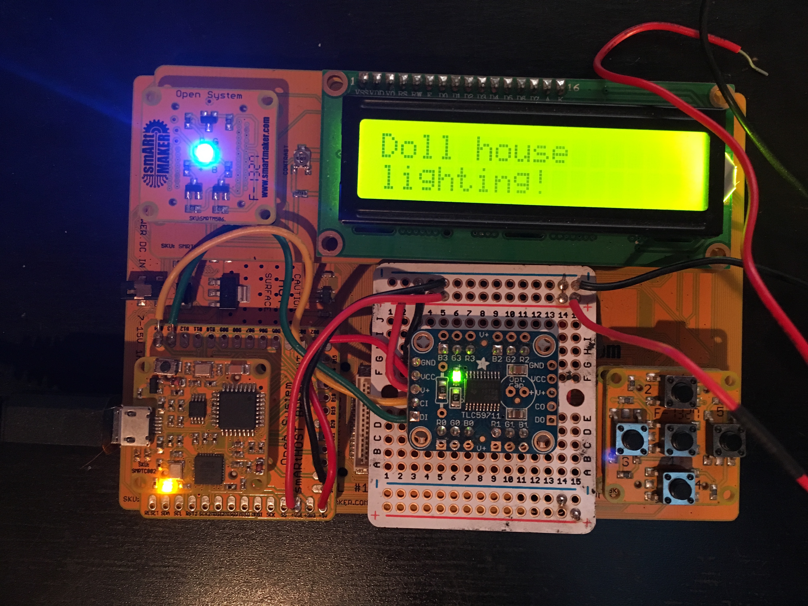

# Dollhouse Lighting Control System

This is the logic for a dollhouse lighting control system that I am building for my daughter.

## The Boards

This code is designed to drive an Arduino-compatible board with a several components attached. For my build, I'm using an Arduino clone from SmartMaker*, along with a few other boards from that system. Here's what I've got going:

* Smartmaker Smartcore U–basically, a weird Arduino Uno
* A Smartmaker Smartbus Quad–this provides the base for the whole system, as well as the power regulator for the Smartcore
* Smartmaker Breakout–a simple breakout board for the microcontroller pins
* Smartmaker LCD 16x2–a standard 16x2 LCD display
* Smartmaker RGB LED board–a single RGB LED
* Smartmaker Button 5A5–an array of 5 momentary switches, attached to analog pins on the Smartcore
* Smartmaker AB Riser–a little board to give some stuff a lift!
* Adafruit 12 channel PWM board-this is a sweet little board that gives you 12 channels for driving LEDs at 16-bit resolution
* Some Adafruit breadboard-friendly NeoPixels
* RadioShack white LED strip–this was originally a single 60 LED, 1 meter strip, which I cut up to make a bunch of 3 LED strips (one for each room)

All of this is powered by a 12V 1A wall brick. The strip LEDs having a pretty good current draw, and the NeoPixels are no slouch, either.

## The Pins!

Here's how things map out for microcontroller pin usage in my build:

<table>
	<tbody>
		<tr>
			<th>Compnent</th>
			<th>Pins used</th>
		</tr>
		<tr>
			<td>RGB LED</td>
			<td>9,10,11</td>
		</tr>
		<tr>
			<td>LCD</td>
			<td>2,3,4,5,6,7</td>
		</tr>
		<tr>
			<td>TL59711 PWM Board</td>
			<td>12,13</td>
		</tr>
		<tr>
			<td>NeoPixels</td>
			<td>8</td>
		</tr>
		<tr>
			<td>Buttons</td>
			<td>A0,A1,A2,A3,A4</td>
		</tr>
	</tbody>
</table>

If you know anything the Arduino (or the microcontroller at its core, the ATMega328), you'll realize that almost all of the pins available have been used in this build.

One of the more annoying things about the Smartmaker stuff is poor planning for the pin usage for the various components. For example, because the 16x2 LCD is wired up directly, rather than with a serial backpack or the like, the board requires six of the Arduino's precious digital I/O pins.

To be honest, I'd have used most of the pins even with a standard Arduino and components. The real rub here is the lack of choice when using Smartmaker's custom bus design. If I want to use these parts up (and I do), I have to work within the constraints imposed by them.

The PWM board helps me address this somewhat. This is a nifty little board with a constant current driver and 16-bit resolution. It's ideal for driving LEDs. Thanks to its twelve channels, I have enough PWM bandwidth to control the light levels in each room of the house independently.

Here's what the whole thing looks like, mashed together sans case:

Ugly, isn't it?

## The State Machines

When I first started building the panel, I used a lot of flags and arrays to try to manage the state of the panel. This was a stupid way to do things. What I really needed was _Finite State Machines_. I've used them on other projects (like [Sploder](https://github.com/stonehippo/sploder),) but not here. Fortunately, I got smarter and I changed that. I've been trying out [arduino-fsm](https://github.com/jonblack/arduino-fsm), which is a pretty simple FSM library, similar (but not quite as full featured), as [the code I've used in other projects](http://playground.arduino.cc/Code/FiniteStateMachine).

There are a few interacting state machines in the panel, including:

- modes — used to determine what mode (off, lighting, party, nitelite) the overall dollhouse lighting should use
- rooms — determines which room the panel is setting

## Pin Change Interrupts make life better

One of the bummers of working with the Smartmaker components is the rather crappy 5 analog button board. This is a silly design: 5 momentary switches on one breakout (so far, so good…), each of which is attached to a different analog pin on the Arduino (Wait, WTF?!). This is an (at least) triply dumb design:

- It uses up most of the `analogRead()` capable pins
- Why the heck would you want to read the analog values on a momentary switch?! It's a freaking push button!
- To the first two issues: if you're going to hook up buttons to an ADC, why not multiplex them using a single pin and something like a set of resistors at varying values so you can distingish individuals pushes?

*Sigh.*

Anyhow, it turns out I was making this dumb design even worse in my firmware. In earlier implementations of the dollhouse panel, I was reading the analog values from the buttons via polling at a rate of about 10Hz. This was dumb for at least a couple of reasons:

- It meant I had to have logic to compare the button's current state with thresholds for "on" and "off" (basically, something like `analogRead() == 0` or `analogRead() == 1023`)
- polling for sensor events *always* sucks; it's just not responsive to things like user input
- I could have read the pins using `digitalRead()` just like any other pin (duh)

This situation is the worst of all possible worlds for input, since the system isn't responsive to all of the button presses, and there's a lot of weird code to try to figure out if the press even happened. Fortunately, there's a better way: Pin Change Interrupts.

On the Atmel ATMega at the core of an Arduino, there are a few interrupt types. The Arduino framework has support for external interrupts, which let you capture event input cleanly. Unfortunately, there are only two INTs and they're attached to pins 2 and 3. But there's also pin change interrupts, or PCINTs. Any of the pins on the Uno, and several of the pins on it's Atmel AVR-based siblings like the Mega, can be used with PCINTs, meaning there's a cleaner way to interrupt-driven events from the stupid 5A5 button setup.

I won't go into the particulars of PCINT usage here (ports, determining rising/falling states, etc.). Instead, I recommend taking a look at [EnableInterrupts](https://github.com/GreyGnome/EnableInterrupt), a handy lib that provides an abstraction layer for INTs and PCINTs.

----------

\* I acquired the Smartmaker stuff as a backer reward from their less-than-stellar Kickstarter campaign. Except for the components that I have used in this project, I have sold off all of my Smartmaker Open System components.
